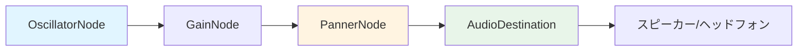

# 音声技術解説

## プロジェクト概要

このプロジェクトは、**音源方向の知覚トレーニング**を目的としたWebアプリケーションです。ユーザーは3D空間内の8方向（前、右前、右、右後、後、左後、左、左前）から再生される音を聴き、その方向を当てるゲームを通じて、空間オーディオの知覚能力を鍛えることができます。

本ドキュメントでは、このプロジェクトで実装されている音声関連技術について詳しく解説します。

---

## 使用技術スタック

### コア技術
- **Web Audio API**: ブラウザネイティブの高性能オーディオ処理API
- **Three.js**: 3Dグラフィックスライブラリ（視覚的なフィードバック）
- **Vite**: モダンなビルドツール

### 主な音声技術
1. Web Audio APIのAudioContext
2. PannerNode（空間オーディオ処理）
3. HRTF（頭部伝達関数）
4. OscillatorNode（音源生成）
5. GainNode（音量制御）
6. AudioListener（リスナー位置・向きの制御）

---

## 1. Web Audio API の基礎

### AudioContext の初期化

[AudioManager.js]では、Web Audio APIの中核となる`AudioContext`を初期化しています。

```javascript
const AudioContext = window.AudioContext || window.webkitAudioContext;
this.ctx = new AudioContext();
```

**技術的ポイント:**
- `AudioContext`は、すべてのオーディオ処理の基盤となるコンテキスト
- ブラウザ互換性のため、`webkitAudioContext`のフォールバックを用意
- ユーザーインタラクション後に初期化（ブラウザのautoplay制限への対応）

---

## 2. 空間オーディオの実装（PannerNode）

### PannerNode とは

`PannerNode`は、Web Audio APIで**3D空間オーディオ**を実現するためのノードです。音源の位置、リスナーの位置・向き、距離減衰などを考慮して、リアルな空間音響を生成します。

### 実装詳細

```javascript
this.panner = this.ctx.createPanner();
this.panner.panningModel = 'HRTF';
this.panner.distanceModel = 'inverse';
this.panner.refDistance = 1;
this.panner.maxDistance = 10000;
this.panner.rolloffFactor = 1;
```

#### パラメータ解説

| パラメータ | 設定値 | 説明 |
|-----------|--------|------|
| `panningModel` | `'HRTF'` | 頭部伝達関数を使用した高品質な空間音響 |
| `distanceModel` | `'inverse'` | 距離に応じた音量減衰モデル（逆比例） |
| `refDistance` | `1` | 音量減衰が始まる基準距離 |
| `maxDistance` | `10000` | 音が聞こえる最大距離 |
| `rolloffFactor` | `1` | 距離減衰の強さ（1 = 自然な減衰） |

---

## 3. HRTF（頭部伝達関数）技術

### HRTF とは

**HRTF（Head-Related Transfer Function）** は、音源から耳に到達するまでの音の変化を数学的にモデル化したものです。人間の頭部、耳介（耳の形状）、胴体による**音響的な影響**を再現することで、ヘッドフォンでもリアルな3D音響を体験できます。

### 本プロジェクトでの活用

```javascript
this.panner.panningModel = 'HRTF'; // Best for headphones
```

**メリット:**
- ヘッドフォン使用時に最も効果的
- 上下左右の音源方向を正確に知覚可能
- 臨場感のある空間オーディオ体験

**技術的背景:**
- 人間は両耳間の音の到達時間差（ITD）と音圧レベル差（ILD）で方向を知覚
- HRTFはこれらの差を人工的に再現
- Web Audio APIは、あらかじめ測定されたHRTFデータセットを使用

---

## 4. 音源位置の制御

### 3D座標での位置設定

[AudioManager.js]では、音源を3D空間の任意の位置に配置できます。

```javascript
setSourcePosition(x, y, z) {
    if (this.panner.positionX.setValueAtTime) {
        this.panner.positionX.setValueAtTime(x, this.ctx.currentTime);
        this.panner.positionY.setValueAtTime(y, this.ctx.currentTime);
        this.panner.positionZ.setValueAtTime(z, this.ctx.currentTime);
    } else {
        // 古いブラウザ向けフォールバック
        this.panner.setPosition(x, y, z);
    }
}
```

**技術的特徴:**
- `AudioParam.setValueAtTime()`を使用し、正確なタイミングで位置を更新
- 古いブラウザAPIとの互換性を確保
- リアルタイムでの位置変更が可能

### 角度から座標への変換

[GameManager.js](file:///c:/Users/Gtaku/Documents/programming/programing%20for%20web/sound-trainning-site/src/game/GameManager.js#L86-L91)では、8方向の角度を3D座標に変換しています。

```javascript
angleToPosition(angleDeg, radius = 2) {
    const angleRad = (angleDeg * Math.PI) / 180;
    const x = radius * Math.sin(angleRad);
    const z = -radius * Math.cos(angleRad);
    return new THREE.Vector3(x, 0, z);
}
```

**座標系:**
- XZ平面上に音源を配置（Y=0）
- 前方：Z軸負の方向（0°）
- 右方：X軸正の方向（90°）
- 半径2メートルの円周上に音源を配置

---

## 5. AudioListener の制御

### リスナーとは

`AudioListener`は、音を「聴く人」の位置と向きを表します。通常、カメラ（ユーザーの視点）と同期させます。

### 実装

[AudioManager.js](file:///c:/Users/Gtaku/Documents/programming/programing%20for%20web/sound-trainning-site/src/audio/AudioManager.js#L50-L63)では、リスナーの向きを設定できます。

```javascript
setListenerOrientation(forwardX, forwardY, forwardZ, upX, upY, upZ) {
    const listener = this.ctx.listener;
    if (listener.forwardX) {
        listener.forwardX.setValueAtTime(forwardX, this.ctx.currentTime);
        listener.forwardY.setValueAtTime(forwardY, this.ctx.currentTime);
        listener.forwardZ.setValueAtTime(forwardZ, this.ctx.currentTime);
        listener.upX.setValueAtTime(upX, this.ctx.currentTime);
        listener.upY.setValueAtTime(upY, this.ctx.currentTime);
        listener.upZ.setValueAtTime(upZ, this.ctx.currentTime);
    }
}
```

**パラメータ:**
- `forward`: リスナーが向いている方向ベクトル
- `up`: リスナーの上方向ベクトル

---

## 6. 音源生成（OscillatorNode）

### シンセサイザー機能

[AudioManager.js](file:///c:/Users/Gtaku/Documents/programming/programing%20for%20web/sound-trainning-site/src/audio/AudioManager.js#L65-L82)では、`OscillatorNode`を使用してリアルタイムに音を生成しています。

```javascript
playSound(duration = 0.5) {
    const osc = this.ctx.createOscillator();
    osc.type = 'sine';
    osc.frequency.setValueAtTime(440, this.ctx.currentTime); // A4音（ラ）
    
    const gainNode = this.ctx.createGain();
    gainNode.gain.setValueAtTime(0.5, this.ctx.currentTime);
    gainNode.gain.exponentialRampToValueAtTime(0.01, this.ctx.currentTime + duration);
    
    osc.connect(gainNode);
    gainNode.connect(this.panner);
    
    osc.start();
    osc.stop(this.ctx.currentTime + duration);
}
```

### オーディオグラフの構造



**処理フロー:**
1. **OscillatorNode**: 440Hz（A4音）のサイン波を生成
2. **GainNode**: 音量を制御し、フェードアウト効果を適用
3. **PannerNode**: 3D空間オーディオ処理
4. **AudioDestination**: 最終出力（スピーカー/ヘッドフォン）

### フェードアウト効果

```javascript
gainNode.gain.exponentialRampToValueAtTime(0.01, this.ctx.currentTime + duration);
```

- `exponentialRampToValueAtTime()`で自然な音量減衰
- 急な音の停止によるクリックノイズを防止

---

## 7. Three.js との統合

### ビジュアルと音声の同期

[SceneManager.js](file:///c:/Users/Gtaku/Documents/programming/programing%20for%20web/sound-trainning-site/src/3d/SceneManager.js)では、Three.jsで3D空間を視覚化しています。

```javascript
// 音源の視覚的表現
const geometry = new THREE.SphereGeometry(0.3, 32, 32);
const material = new THREE.MeshStandardMaterial({
    color: 0x00ff00,
    emissive: 0x00ff00,
    emissiveIntensity: 0.5
});
this.sourceMesh = new THREE.Mesh(geometry, material);
```

### 座標系の統一

- **Three.js座標系**: 右手座標系（Z軸が手前方向）
- **Web Audio API座標系**: 右手座標系（Z軸が手前方向）
- 両方のAPIで座標系が一致しているため、シームレスな統合が可能

---

## 8. ゲームロジックと音声の連携

### 問題生成と音源配置

[GameManager.js](file:///c:/Users/Gtaku/Documents/programming/programing%20for%20web/sound-trainning-site/src/game/GameManager.js#L112-L146)では、ラウンドごとに音源を配置し、音を再生します。

```javascript
nextRound() {
    // 8方向からランダムに選択
    const dir = this.questionQueue[this.currentRound - 1];
    
    // 座標計算
    this.currentPosition = this.angleToPosition(dir.angle);
    
    // 音声と視覚の更新
    this.audioManager.setSourcePosition(
        this.currentPosition.x, 
        this.currentPosition.y, 
        this.currentPosition.z
    );
    this.sceneManager.setSourcePosition(this.currentPosition);
    
    // 問題中は音源を非表示
    this.sceneManager.setSourceVisible(false);
    
    // 音を再生
    this.playSound();
}
```

### 再生回数制限

```javascript
playSound() {
    if (this.playCount >= this.maxPlayCount) return; // 最大2回まで
    this.playCount++;
    this.audioManager.playSound(1.0); // 1秒間の音
}
```

---

## 9. 技術的な工夫とベストプラクティス

### 1. ブラウザ互換性への配慮

```javascript
const AudioContext = window.AudioContext || window.webkitAudioContext;
```

- Safari対応のため`webkitAudioContext`をフォールバック
- 新旧API両方に対応（`setValueAtTime` / `setPosition`）

### 2. Autoplay ポリシーへの対応

- ユーザーインタラクション（ゲーム開始ボタン）後にAudioContextを初期化
- ブラウザのautoplay制限を回避

### 3. パフォーマンス最適化

```javascript
osc.stop(this.ctx.currentTime + duration);
```

- 使用後のOscillatorNodeを適切に停止し、メモリリークを防止
- 毎回新しいOscillatorを生成（再利用不可のため）

### 4. クリーンなアーキテクチャ

各機能を独立したモジュールに分離:
- **AudioManager**: 音声処理
- **SceneManager**: 3D描画
- **GameManager**: ゲームロジック
- **UIManager**: ユーザーインターフェース

---

## 10. 今後の拡張可能性

### 実装可能な高度な機能

1. **音源のドップラー効果**
   ```javascript
   panner.dopplerFactor = 1;
   ```

2. **障害物による音の遮蔽**
   - ConvolverNodeを使った反響・吸収シミュレーション

3. **リアルな音源（音声ファイル）の使用**
   ```javascript
   const audioElement = new Audio('path/to/sound.mp3');
   const source = ctx.createMediaElementSource(audioElement);
   source.connect(panner);
   ```

4. **バイノーラル録音の再生**
   - HRTF以上にリアルな空間音響体験

5. **複数音源の同時再生**
   - より複雑なトレーニングシナリオ

---

## まとめ

本プロジェクトでは、Web Audio APIの強力な機能を活用し、ブラウザ上で本格的な**空間オーディオ体験**を実現しています。特に以下の点が技術的な特徴です：

### 主要な技術的達成
- ✅ **HRTF による高品質な3D音響**
- ✅ **PannerNode による正確な空間定位**
- ✅ **Three.js との座標系統合**
- ✅ **リアルタイム音源生成と制御**
- ✅ **クロスブラウザ互換性の確保**

### 学習ポイント
このプロジェクトを通じて理解できる概念：
- Web Audio APIのノードベースアーキテクチャ
- 空間オーディオの数学的原理
- AudioContextのライフサイクル管理
- 3D座標系での音響処理
- ブラウザAPIの互換性対応

---

## 参考リンク

- [Web Audio API 仕様](https://www.w3.org/TR/webaudio/)
- [MDN Web Audio API ドキュメント](https://developer.mozilla.org/ja/docs/Web/API/Web_Audio_API)
- [Three.js 公式ドキュメント](https://threejs.org/docs/)
- [HRTF について（英語）](https://en.wikipedia.org/wiki/Head-related_transfer_function)

---

**作成日**: 2026年1月26日  
**プロジェクト**: Sound Direction Training Game  
**技術スタック**: Web Audio API, Three.js, Vite
